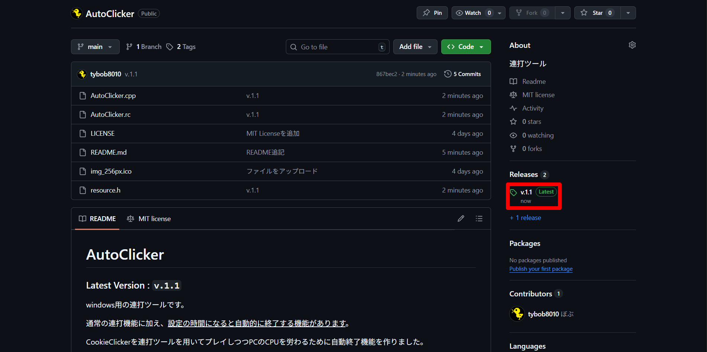
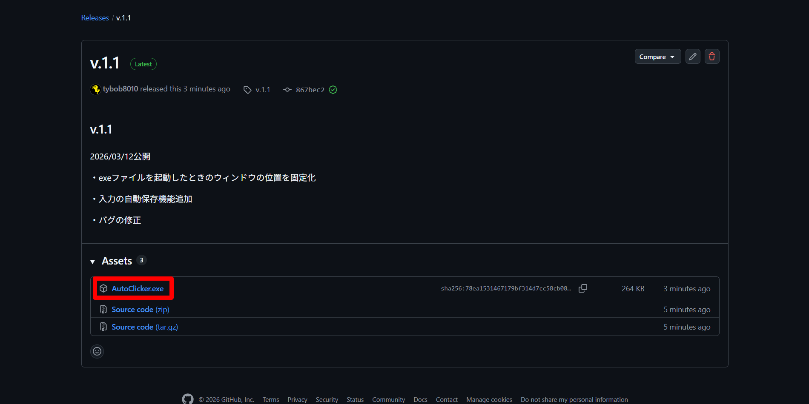
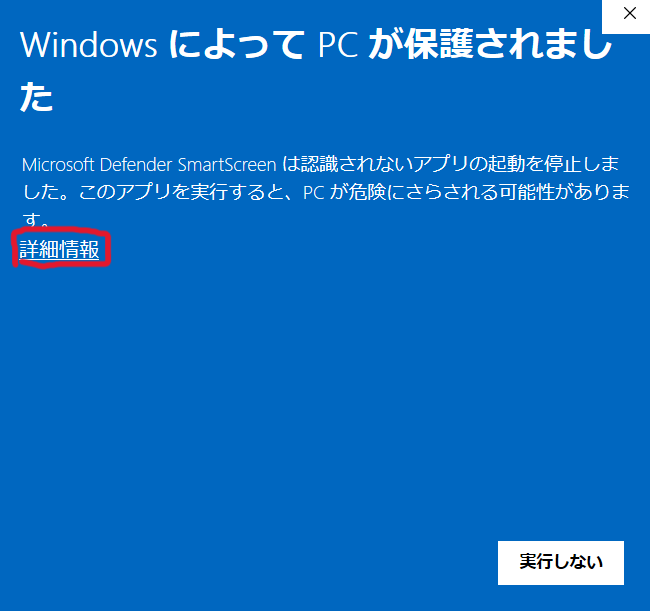
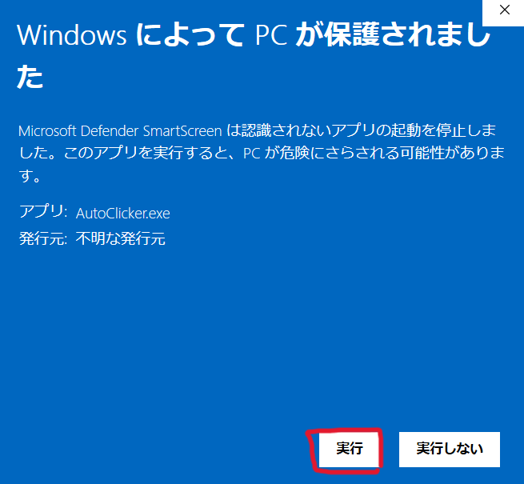
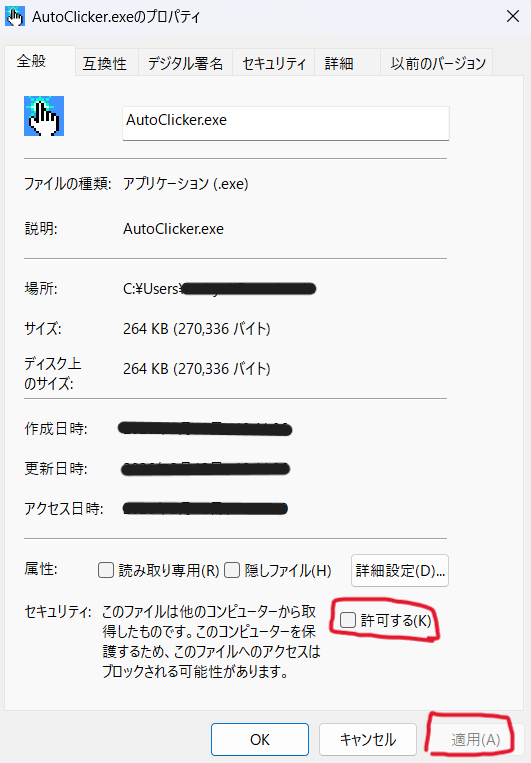

# AutoClicker

* [ダウンロード方法](#ダウンロード方法)
* [起動方法](#起動方法)
* [バージョン情報](#バージョン情報)
### Latest Version : `v.1.1.1`

windows用の連打ツールです。**Mac、Linuxでは使用できません。**

通常の連打機能に加え、<ins>設定の時間になると自動的に終了する機能があります</ins>。

CookieClickerを連打ツールを用いてプレイしつつPCのCPUを労わるために自動終了機能を作りました。

ライセンスは[こちら](LICENSE)

© 2026 tybob

 

## ダウンロード方法
### 1. 「Release」の Latest と表示されているバージョンをクリック

### 2. 「AutoClicker.exe」をクリック（ダウンロードされます）

 

## 起動方法
### 1. ダウンロードした「AutoClicker.exe」を起動

### 2. 以下の警告が開くので、「詳細表示」を押して「実行」

**このウィンドウが開くのはダウンロード数が少なく、自動的に危険なファイルと認識されてしまうからです。**

**危険ではないことは本リポジトリ内の.cpp等をご確認ください。**

### 3. 警告を出さないようにする方法

ダウンロードしたexeファイルを右クリックし、「プロパティ」を選択する

「全般」タブの一番下にある「□許可する」にチェックを入れ、「適用」を押す

**3. によってexeファイルを起動した際に警告は出なくなります。**

 

## バージョン情報
### v.1.1.1

2026/03/14公開

・最小化ウィンドウで閉じたのち再度開いたときにウィンドウが表示されないバグを改善

### v.1.1

2026/03/12公開

・exeファイルを起動したときのウィンドウの位置を固定化

・入力の自動保存機能追加

・バグの修正

### v.1.0

2026/03/08公開

・自動終了機能を持った連打ツールを公開。
